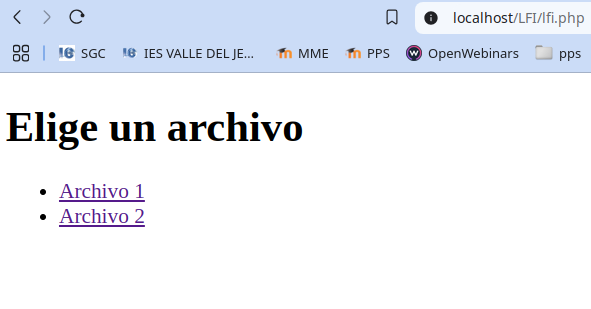
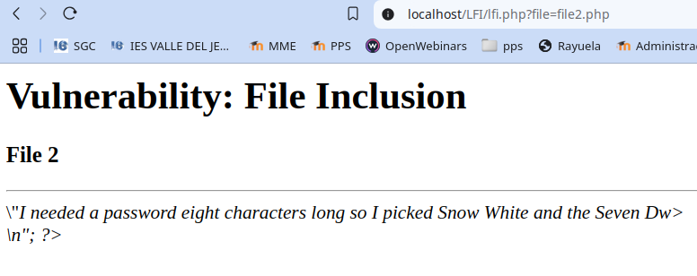
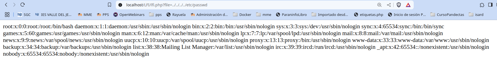
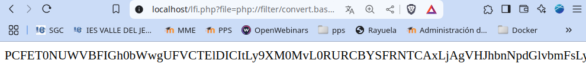
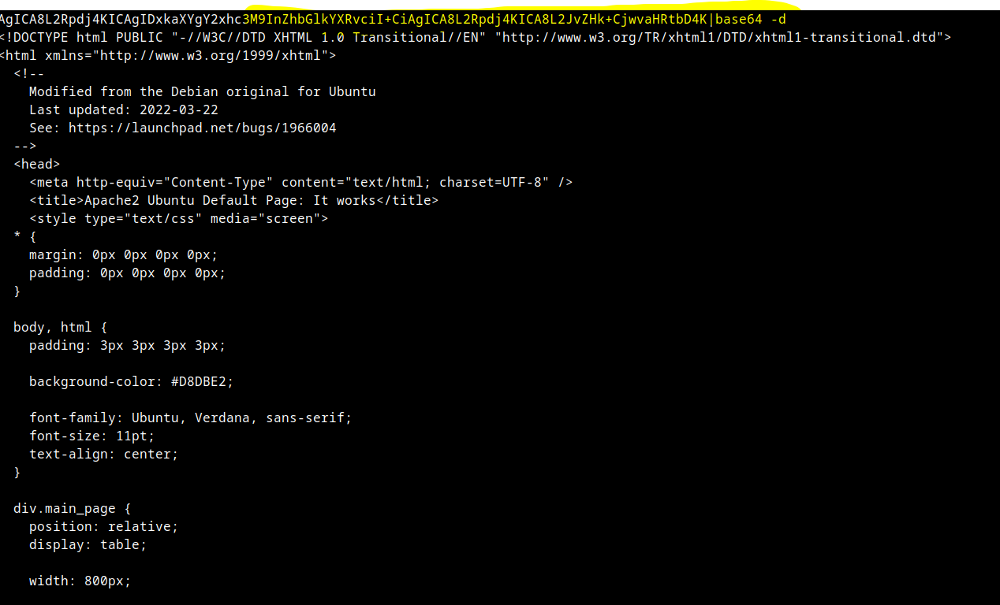
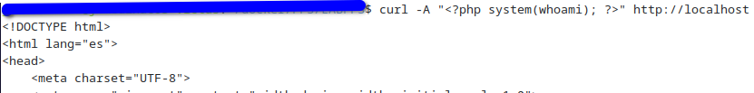
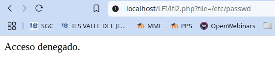
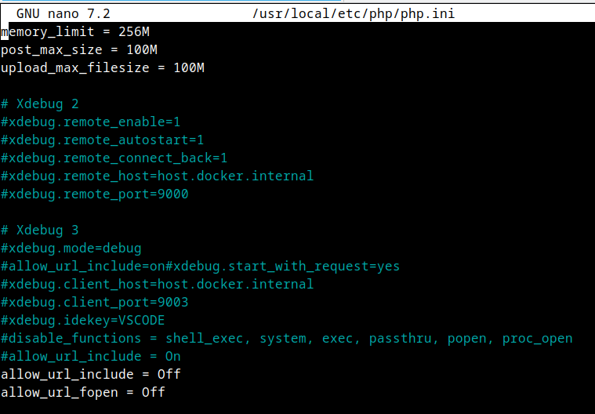

# PPS-Unidad3Actividad8-LFI
Explotación y Mitigación de ataque de Inclusión de Ficheros locales (LFI).
Tenemos como objetivo:

> - Ver cómo se pueden hacer ataques de Local File Inclusion.
>
> - Analizar el código de la aplicación que permite ataques de Local File Inclusion.
>
> - Implementar diferentes modificaciones del codigo para aplicar mitigaciones o soluciones.

## ¿Qué es Inclusión de archivos locales (LFI)?
---

La inclusión local de archivos (también conocida como LFI) es el proceso de incluir archivos, que ya están presentes localmente en el servidor, a través de la explotación de procedimientos de inclusión vulnerables implementados en la aplicación. Esta vulnerabilidad ocurre, por ejemplo, cuando una página recibe, como entrada, la ruta al archivo que debe incluirse y esta entrada no se desinfecta correctamente, lo que permite inyectar caracteres de salto de directorio (como punto-punto-slash). Aunque la mayoría de los ejemplos apuntan a scripts PHP vulnerables, debemos tener en cuenta que también es común en otras tecnologías como JSP, ASP y otras.

Esto puede conducir a algo como la salida del contenido del archivo, pero dependiendo de la gravedad, también puede conducir a:

- Ejecución de código en el servidor web

- Ejecución de código en el lado del cliente, como JavaScript, que puede conducir a otros ataques, como secuencias de comandos en sitios cruzados (XSS)

- Denegación de Servicio (DoS)

- Divulgación de Información Sensible

## ACTIVIDADES A REALIZAR
---

> Lee detenidamente la sección de Local File  de la página de PortWigger <https://portswigger.net/web-security/file-path-traversal>

> Lee el siguiente [documento sobre Explotación y Mitigación de ataques de Remote Code Execution](./files/ExplotacionYMitigacionLFI.pdf)
 
> También y como marco de referencia, tienes la sección de correspondiente de ataque LFI Local File Inclusion **Proyecto Web Security Testing Guide** (WSTG) del proyecto **OWASP**: <https://owasp.org/www-project-web-security-testing-guide/stable/4-Web_Application_Security_Testing/07-Input_Validation_Testing/11.1-Testing_for_Local_File_Inclusion>

En esta ocasión vamos a recrear los archivos que tenemos para el entrenamiento de esta vulnerabilidad en la [máquina DVWA](https://github.com/digininja/DVWA)

Vamos realizando operaciones:

## Código vulnerable
---
Tenemos el archivo vulnerable lfi.php con el siguiente contenido.
~~~
<?php

if (isset($_GET['file'])) {
    $file = $_GET['file'];
    echo file_get_contents($file);
}

?>

<!DOCTYPE html>
<html>
<head>
    <meta charset="UTF-8">
    <title>Ejemplo de Enlaces</title>
</head>
<body>
    <h1>Elige un archivo</h1>
    <ul>
        <li><a href="?file=file1.php">Archivo 1</a></li>
        <li><a href="?file=file2.php">Archivo 2</a></li>
    </ul>
</body>
</html>

?>

~~~
Este archivo nos muestra para hacer click en dos elementos que nos llevan a dos páginas diferentes: file1.php y file2.php con el siguiente contenido

file1.php
~~~
<?php

$file[ 'body' ] .= "

        <h1>Vulnerability: File Inclusion</h1>
        

                <h3>File 1</h3>
                Hola  tio, esto es el archivo 1
        

?>

~~~
Esta página simplemente nos muestra un mensaje, al igual que el siguiente:

El archivo file2.php tiene el siguiente contenido: 

~~~
<?php

$file[ 'body' ] .= "

        <h1>Vulnerability: File Inclusion</h1>
        

                <h3>File 2</h3>
                

                \"<em>I needed a password eight characters long so I picked Snow White and the Seven Dw>

\<<n";

?>
~~~

Al pulsar en los enlaces nos muestra el contenido de los archivos

## Explotación de LFI
---
**Leer archivos sensibles**

Si nos damos cuenta al pulsar en enlace al archivo el navegador nos lleva a **http://localhost/lfi.php?file=file1.php**. Démonos cuenta de que podemos modificar manualmente el fichero a mostrar cambiando file1.php por cualquier otro contenido o ruta.

Prueba básica: Para saber si una página es vulnerable a LFI y teniendo en cuenta que la página que mostramos debe de estar en directorio /var/www/html, podemos intentar ponerle la ruta de un archivo, tanto en ruta absoluta como relativa. 

Si ponemos la ruta de /etc/passwd podemos intentar ver los datos de usuarios del sistema.

~~~
http://localhost/lfi.php?file=../../../../etc/passwd
~~~

Si devuelve similar a:

 
La aplicación es vulnerable a LFI.

**Ejecutar código PHP (PHP Wrappers)**
---
Si la aplicación permite incluir archivos .php, se podría ejecutar código malicioso.

Ejemplo con php://filter para leer código fuente de archivos PHP: Vamos a intentar extraer el código del archivo index.html del servidor, aunque podríamos acceder a cualquiera:

Para que funcione este ataque tienen que estar activada la función de PHP allow_url_include. 

Si tenemos levantado el escenario en docker tenemos que acceder al contenedor del servidor web:

~~~
docker exec -it lamp-php83  /bin/bash
~~~

y editamos el archivo de configuración de php. Recordamos que en nuestro contendor está en una ruta diferente.

~~~
nano /usr/local/etc/php/php.ini
~~~

y ponermos la variable allow_url_include a on. Aquí tienes el [php.ini](files/php.ini.lfi) para hacer las pruebas.

~~~
allow_url_include=on
~~~

Después reiniciamos el servicio.

Vamos a realizar el ataque, para ver si podemos ejecutar php en el servidor y así obtener el código del archivo index.html o cualquier otro del servidor. (Si no tienes index.html en tu servidor, crea uno o pon la ruta de otro archivo en la siguiente dirección). 

~~~
http://localhost/lfi.php?file=php://filter/convert.base64-encode/resource=index.html
~~~

- file= → Se usa un parámetro vulnerable en lfi.php que permite incluir archivos arbitrarios en el servidor.php://filter/convert.base64-encode/resource=index.html:
- php://filter → Es un wrapper especial de PHP que permite aplicar filtros de manipulación de datos.
	- convert.base64-encode → Codifica el contenido del archivo en Base64 en lugar de mostrarlo directamente.
	- resource=index.html → Especifica el archivo que se quiere leer, en este caso index.html.

**Decodificar la cadena en Base64 y mostrar el resultado:**

Copiamos la cadena que hemos obtenido y realizamos la decodificación:

~~~
echo "BASE64_ENCODED_DATA" | base64 -d
~~~

De esta forma hemos obtenido el contenido de un archivo que no debería de ser accesible. Es posible que podamos encontrar en este u otro archivo un comentario con la contraseña, el código funte, etc....

**Remote Code Execution (RCE) con Log Poisoning**

Si la aplicación escribe entradas de usuario en logs, se podría inyectar código PHP malicioso en ellos. Así podríamos realizar operaciones no permitidas.  Esa información de esta forma la podemos enviar a los logs del sistema, para despues tener acceso a dichos logs y así obtener información sensible..

Enviar payload en User-Agent (inyectar en logs de Apache). Ejecutamos en un terminal de comandos

~~~
curl -A "<?php system('whoami'); ?>" http://localhost
~~~
Esto intenta ejecutar el código php para solicitar el usuario que está ejecutando el servidor de localhost. El resultado de la información "whoami" irá a los logs de apache2.

Hacemos un LFI para  Incluir el log, y así poder recuperar el resultado del comando ejecutado:

~~~
http://localhost/lfi.php?file=/var/log/apache2/access.log
~~~

o si lo tenemos en la pila LAMP de docker en:

~~~
http://localhost/lfi.php?file=/var/log/apache2/other_vhosts_access.log
~~~

Si se muestra el resultado de **whoami**, LFI ha escalado a la ejecución de comandos (RCE).

### Mitigación de LFI
---

**Usar una Lista Blanca de Archivos Permitidos**
---
Una primera mitigación que podemos realizar es una lista blanca, de manera que sólo podamos incluir los archivos de una lista. En nuestro caso: file1.php y file2.php

~~~
<?php
// Establecemos una lista de archivos que se pueden incluir
$whitelist = ["file1.php", "file2.php"];
if (isset($_GET['file'])) {
        $file = $_GET['file'];
        if (!in_array($file, $whitelist)) {
                die("Acceso denegado.");
        }
        echo file_get_contents($file);
}

?>

<!DOCTYPE html>
<html>
<head>
    <meta charset="UTF-8">
    <title>Ejemplo de Enlaces</title>
</head>
<body>
    <h1>Elige un archivo</h1>
    <ul>
        <li><a href="?file=file1.php">Archivo 1</a></li>
        <li><a href="?file=file2.php">Archivo 2</a></li>
    </ul>
</body>
</html>
~~~

Si intentamos incluir cualquier otro archivo nos dá acceso denegado:
 

**Bloquear Secuencias de Directorios (../)**
---
Con *str_contains* verificamos si el nombre del archivo contiene ".." y denegaríamos el acceso. 

~~~
?php

if (isset($_GET['file'])) {
    $file = $_GET['file'];

        // Verificar si el nombre del archivo contiene ".." (para prevenir LFI)
        if (str_contains($file, '..')) {
            die("Acceso denegado.");
        }    // Normalizamos la ruta para evitar ataques con '../'
        // mostramos contenido del archivo
        echo file_get_contents($file);

}
?>
<!DOCTYPE html>
<html>
<head>
    <meta charset="UTF-8">
    <title>Ejemplo de Enlaces</title>
</head>
<body>
    <h1>Elige un archivo</h1>
    <ul>
        <li><a href="?file=file1.php">Archivo 1</a></li>
        <li><a href="?file=file2.php">Archivo 2</a></li>
    </ul>
</body>
</html>
~~~

**Restringir el Tipo de Archivo**

Una posible mitigación es permitir sólo archivos con una determinada extensión.

Por ejemplo si solo queremos permitir archivos .php, filtramos la extensión:

~~~
<?php
if (isset($_GET['file'])) {
        $file = $_GET['file'];
        // Validar que el archivo tenga la extensión .php
        if (pathinfo($file, PATHINFO_EXTENSION) !== 'php') {
            die("Acceso denegado.");
        }
    echo file_get_contents($file);
}

?>

<!DOCTYPE html>
<html>
<head>
    <meta charset="UTF-8">
    <title>Ejemplo de Enlaces</title>
</head>
<body>
    <h1>Elige un archivo</h1>
    <ul>
        <li><a href="?file=./files/file1.txt">Archivo 1</a></li>
        <li><a href="?file=./files/file2.php">Archivo 2</a></li>
    </ul>
</body>
</html>
~~~

Bloquea archivos con extensiones no deseadas, o mejor dicho, sólo nos va a permitir incluir archivos con las extensiones especificadas.

Para probar el funcionamiento, copia el file1.php como file1.txt. Si estamos trabajando con la pila LAMP Docker:

~~~
cp www/file1.php www/file1.txt
~~~

Vemos como en este caso, nos dejará acceso al Archivo2.ph, pero no al Archivo1.txt

**Deshabilitar allow_url_include y allow_url_fopen en php.ini**

~~~
allow_url_include = Off
allow_url_fopen = Off
~~~

Aquí puedes encontrar el fichero de configuración [php.ini](files/php.ini.lfi2).

Recuerda reiniciar el servicio para que se apliquen las configuraciones, por ejemplo reiniciando el contenedor si usas docker:

~~~
docker-compose restart webserver
~~~

¿Qué hacen estas configuraciones?

1. La directiva de configuración de PHP allow_url_include está habilitada. Al estar habilitada, permite la recuperación de datos desde ubicaciones remotas (sitio web o servidor FTP) para funciones como fopen y file_get_contents.

2. La directiva allow_url_fopen le permite el acceso por URL a ficheros mediante funciones como fopen, require e include. Muchos plugins de varios CMS (Wordpress, Prestashop, etc) requieren que allow_url_fopen esté activo en su hosting.

En nuestro caso seguiría funcionando pero evita ataques de Remote File Inclusion (RFI). Eso sí, no podríamos utilizar funciones como fopen y file_get_contents.

**Usar realpath() para Evitar Path Traversal  y asegurar que archivos están en el mismo directorio**

De esta forma garantizamos que no haya una ruta trasnversal para llevarmos a una ruta diferente a donde están ubicados los directorios.

~~~
<?php
// Establecemos el directorio permitido en el mismo directorio del script
$baseDir = __DIR__ . DIRECTORY_SEPARATOR;

if (isset($_GET['file'])) {
    $file = $_GET['file'];

    // Normalizamos la ruta para evitar ataques con '../'
    $filePath = realpath($baseDir . $file);
    // Verificamos si el archivo está dentro del directorio permitido
    if ($filePath === false || strpos($filePath, $baseDir) !== 0) {
        die("Acceso denegado.");
    }

    // Verificamos que el archivo realmente existe
    if (!file_exists($filePath)) {
        die("El archivo no existe.");
    }
    echo file_get_contents($file);

}
?>
<!DOCTYPE html>
<html>
<head>
    <meta charset="UTF-8">
    <title>Ejemplo de Enlaces</title>
</head>
<body>
    <h1>Elige un archivo</h1>
    <ul>
        <li><a href="?file=file1.php">Archivo 1</a></li>
        <li><a href="?file=file2.php">Archivo 2</a></li>
    </ul>
</body>
</html>
~~~

- Asi verificamos de directorios están en el mismo directorio que lfi.php

- También comprobamos que el archivo existe.

- Garantiza que el archivo esté en el direcotorio indicado: $baseDir

Para finalizar, volvemos a restaurar el fichero de configuracióbn a su estado original.

Accedemos al servidor web y resturamos php.ini

~~~
cp /usr/local/etc/php/php.ini.original /usr/local/etc/php/php.ini         
~~~

### **Código seguro**
---

Aquí está el código securizado:

~~~
<?php
// Definir el directorio seguro donde están los archivos permitidos
// ejemplo $directorio_permitido = __DIR__ . '/archivos_permitidos/';
$directorio_permitido = './';

// Lista blanca de archivos permitidos
$archivos_permitidos = [
    'file1.php',
    'file2.php'
];

// Verificar si se ha pasado un archivo por parámetro
if (isset($_GET['file'])) {
    $file = $_GET['file'];

    // Validar que el archivo está en la lista blanca
    if (!in_array($file, $archivos_permitidos, true)) {
        die("Acceso denegado.");
    }

    // Obtener la ruta real del archivo
    $ruta_real = realpath($directorio_permitido . $file);

    // Asegurar que la ruta real está dentro del directorio permitido
    if (!$ruta_real || !str_starts_with($ruta_real, realpath($directorio_permitido))) {
        die("Acceso denegado.");
    }

    // Mostrar el contenido del archivo de forma segura
    echo nl2br(htmlspecialchars(file_get_contents($ruta_real)));
}
?>
<!DOCTYPE html>
<html lang="es">
<head>
    <meta charset="UTF-8">
    <title>Ejemplo de Enlaces</title>
</head>
<body>
    <h1>Elige un archivo</h1>
    <ul>
        <li><a href="?file=file1.php">Archivo 1</a></li>
        <li><a href="?file=file2.php">Archivo 2</a></li>
    </ul>
</body>
</html>
~~~
🔒 Medidas de seguridad implementadas

- Lista blanca de archivos permitidos ($archivos_permitidos):

	- Solo permite los archivos explícitamente definidos en la lista.

	- Un atacante no puede solicitar otros archivos del servidor.

- Usa realpath() y str_starts_with() para evitar rutas maliciosas:

	- Evita ../ y rutas fuera del directorio permitido.

- Escapa el contenido del archivo antes de mostrarlo (htmlspecialchars()):

	- Evita ataques XSS si el archivo contiene código HTML.

	- nl2br() mantiene los saltos de línea.

🚀 Resultado

✔ Solo permite file1.php y file2.php.

✔ Bloquea cualquier intento de LFI o acceso no autorizado.

✔ Evita XSS mostrando contenido de forma segura.

## ENTREGA

> __Realiza las operaciones indicadas__

> __Crea un repositorio  con nombre PPS-Unidad3Actividad8-Tu-Nombre donde documentes la realización de ellos.__

> No te olvides de documentarlo convenientemente con explicaciones, capturas de pantalla, etc.

> __Sube a la plataforma, tanto el repositorio comprimido como la dirección https a tu repositorio de Github.__

